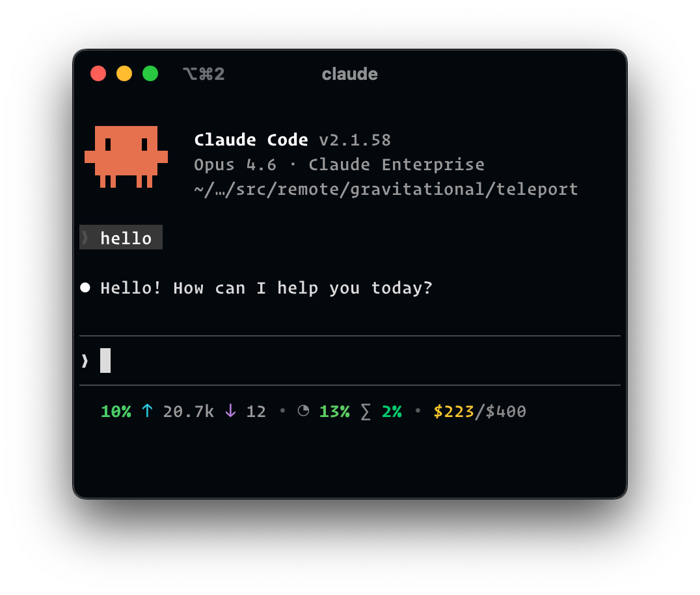

# statusline

A fast, native statusline for [Claude Code](https://docs.anthropic.com/en/docs/claude-code) that shows context window usage and API rate limits.

<p align="center">
  
</p>

Reads from Claude Code's statusline JSON on stdin and fetches usage data from claude.ai using your browser session.

## Install

```
brew tap ryanclark/statusline
brew install statusline
```

Or build from source:

```
make install
```

## Setup

Find your organization ID from [claude.ai/settings](https://claude.ai/settings) (it's in the URL), then run:

```
statusline install -o <org-id>
```

This saves your org ID and configures Claude Code's `settings.json` to use statusline.

### Keychain access

Statusline reads your Chrome session cookie to authenticate with claude.ai. On first run, macOS will prompt you to allow access to "Chrome Safe Storage" in Keychain. Select **Always Allow** so it doesn't prompt on every invocation.

## What it shows

- **Context window** — percentage used, input/output token counts
- **5-hour rate limit** — current utilization with reset countdown when above threshold
- **7-day rate limit** — same as above
- **Extra usage** — spend against monthly limit (if applicable)

## Options

Override the thresholds for showing reset countdowns:

```
statusline -f 50 -s 80
```

Or set them permanently during install:

```
statusline install -o <org-id> -f 50 -s 80
```

The defaults are `-f 70` (show 5-hour reset countdown above 70%) and `-s 100` (never show 7-day reset countdown). Setting a threshold to `100` effectively disables the countdown for that period.

## Building from source

### Basic build

```
make install
```

This builds without codesigning. The Chrome Keychain password is cached locally to `~/.statusline/chrome_key` to avoid repeated Keychain prompts during development.

### Codesigned build

Codesigning makes Keychain's "Always Allow" persist across rebuilds. You need an [Apple Developer Program](https://developer.apple.com/programs/) membership.

#### Creating a certificate

If you don't have a Developer ID Application certificate yet:

```
make cert-request DEVELOPER_NAME="Your Name"
```

This generates a certificate signing request. Upload `devid.csr` at the URL shown, select **Developer ID Application**, and download the `.cer` file. Then import it:

```
make cert-import CER=~/Downloads/developerID_application.cer
```

This installs the certificate into your Keychain and prints your signing identity. Clean up afterwards:

```
make cert-clean
```

#### Building

```
make install-signed DEVELOPER_NAME="Your Name" TEAM_ID="ABC123XYZ"
```

To find your name and team ID:

```
security find-identity -v -p codesigning | grep "Developer ID Application"
```

## Requirements

- macOS (Apple Silicon)
- Google Chrome (for session cookie access)
- Rust toolchain (for building from source)
