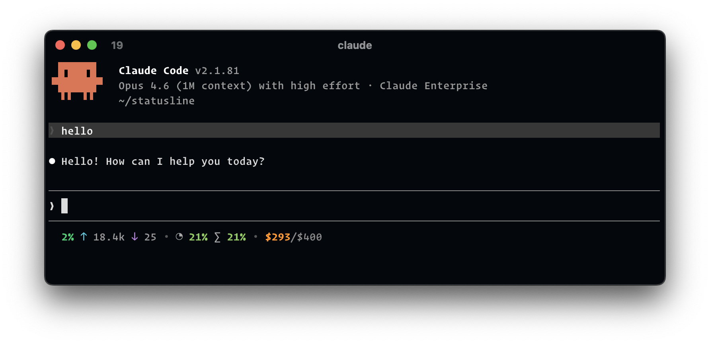
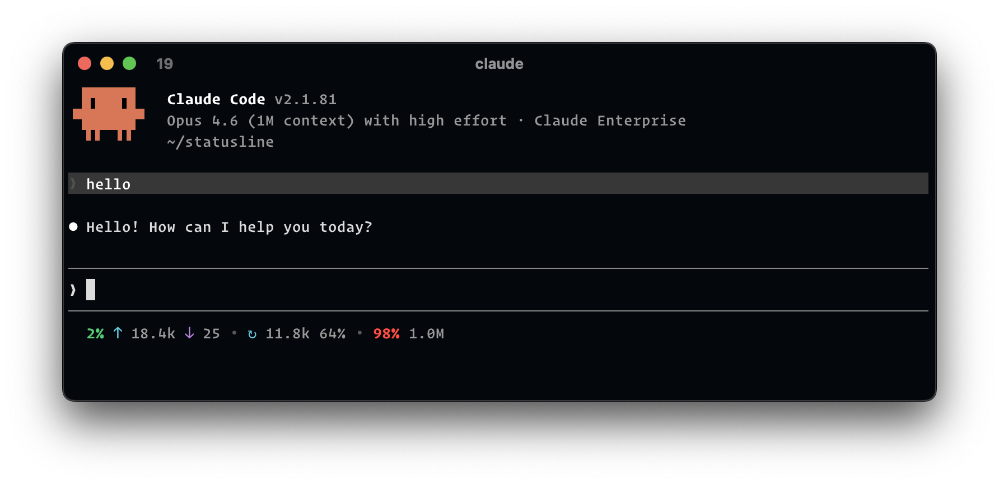
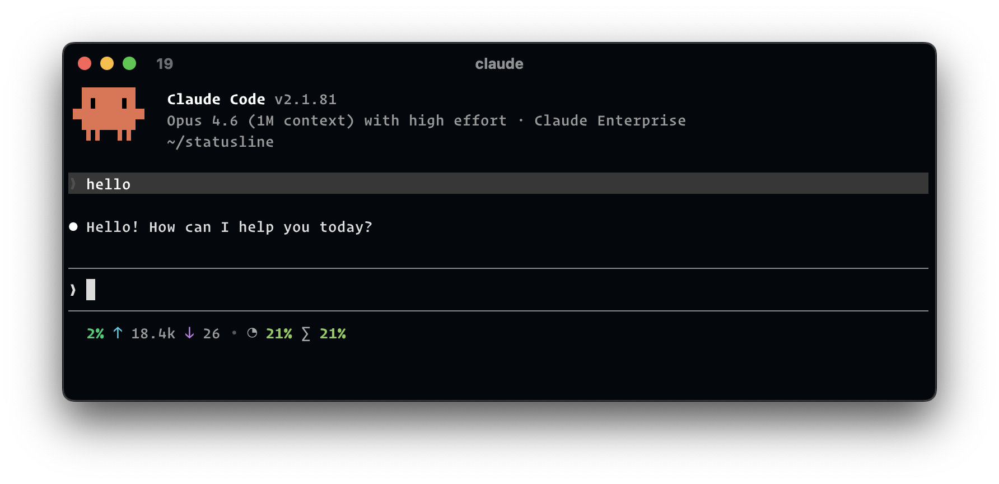
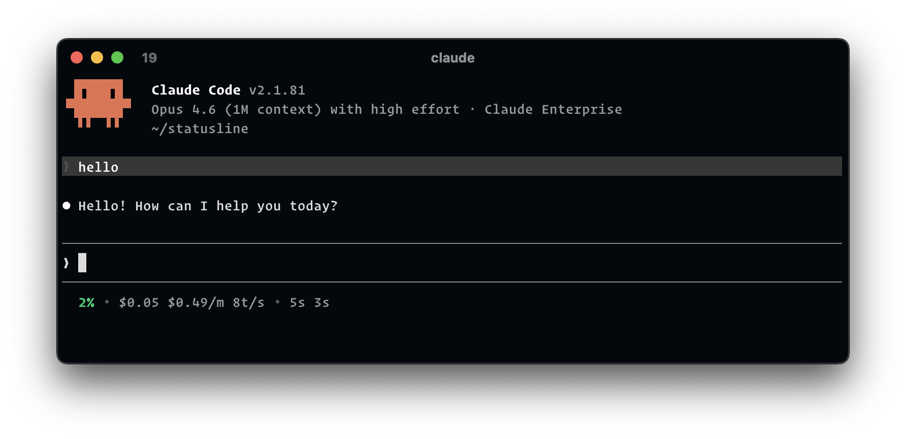
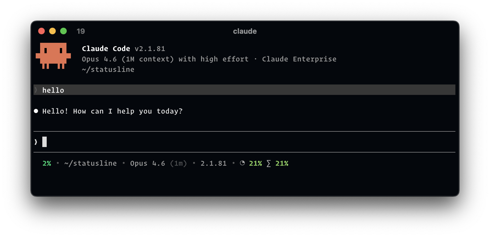

# statusline

A fast, native statusline for [Claude Code](https://docs.anthropic.com/en/docs/claude-code) that shows context window usage, session/weekly usage limits and extra usage credits.

<p align="center">
  
</p>

## Examples

#### Context window

`["context_percentage", "input_tokens", "output_tokens", "divider", "cache_read_tokens", "cache_hit_ratio", "divider", "context_remaining", "context_window_size"]`



#### Rate limits

`["context_percentage", "input_tokens", "output_tokens", "divider", "five_hour", "seven_day"]`



#### Cost & performance

`["context_percentage", "divider", "cost", "cost_rate", "tokens_per_second", "divider", "duration", "api_duration", "divider", "lines_added", "lines_removed"]`



#### Git info

`["context_percentage", "input_tokens", "output_tokens", "divider", "cwd", "divider", {"type": "git_branch", "dirty": true}, "git_ahead_behind", "git_stash"]`


#### Environment

`["context_percentage", "divider", "cwd", "divider", "model", "divider", "version", "divider", "five_hour", "seven_day"]`



## Install

```
brew install ryanclark/tap/statusline
```

macOS (Apple Silicon) and Linux (arm64/amd64) are supported.
> [!NOTE]
> Keychain access to "Chrome Safe Storage" is only needed if you use the `extra_usage` segment (see below).

Or, without Homebrew, install a prebuilt binary from the latest GitHub release:

```
curl -fsSL https://raw.githubusercontent.com/ryanclark/statusline/main/install.sh | sh
```

The binary is installed to `~/.local/bin` (override with `INSTALL_DIR=...`). Append `-s -- v1.0.0` after `sh` to pin a version.

Or build from source (requires [just](https://github.com/casey/just)):

```
just install
```

## Setup

```
statusline install
```

This saves default settings and wires up Claude Code's `settings.json` to call `statusline`. The organization shown in the `extra_usage` segment is read from Claude Code's own `~/.claude.json` at runtime, so it always matches the currently-active account.

### Keychain access (extra_usage only)

If you include the `extra_usage` segment, statusline reads your Chrome session cookie to fetch spend data from claude.ai. On first run, macOS will prompt you to allow access to "Chrome Safe Storage" in Keychain. Select **Always Allow** so it doesn't prompt on every invocation.

If you don't use the `extra_usage` segment, no Chrome access or API calls are needed.

## What it shows

By default:

- **Context window** — percentage used, input/output token counts
- **5-hour rate limit** — current utilization with reset countdown when above threshold
- **7-day rate limit** — same as above
- **Extra usage** — spend against monthly limit (requires Chrome cookie auth)

## Customising segments

Add a `segments` array to `~/.statusline/settings.json` to control what's shown and in what order:

```json
{
  "five_hour_reset_threshold": 70,
  "seven_day_reset_threshold": 100,
  "segments": [
    "context_percentage",
    "input_tokens",
    "output_tokens",
    "divider",
    "cwd",
    {"type": "git_branch", "dirty": true},
    "model",
    "divider",
    "five_hour",
    "seven_day",
    "divider",
    "extra_usage"
  ]
}
```

If `segments` is not set, the default layout is used: `context_percentage`, `total_input_tokens`, `output_tokens`, `divider`, `five_hour`, `seven_day`, `divider`, `extra_usage`.

### Interactive editor

Instead of editing the JSON by hand, run:

```
statusline configure
```

This opens an interactive editor with a live preview to add, remove, reorder and toggle segments and edit their options, writing the result to `~/.statusline/settings.json` (existing keys are preserved). Key hints: ↑↓ move, ⇧↑/⇧↓ reorder, space toggle, → options, `a` add, `s` save, `q` quit.

### Available segments

#### Context window

| Segment | Description |
|---|---|
| `context_percentage` | Context window used % (colored) |
| `context_remaining` | Remaining context % (colored) |
| `context_window_size` | Total context size (e.g. `200k`) |
| `total_input_tokens` | Current context input tokens (input + cache creation + cache read) with ↑ icon |
| `input_tokens` | Cumulative input tokens across the session with ↑ icon |
| `output_tokens` | Total output tokens with ↓ icon |
| `cache_read_tokens` | Cache read tokens with ↻ icon |
| `cache_hit_ratio` | Cache read as % of total input |
| `exceeds_200k` | Warning indicator when context exceeds 200k tokens |

#### Rate limits

| Segment | Description |
|---|---|
| `five_hour` | 5-hour rate limit % with optional reset countdown |
| `seven_day` | 7-day rate limit % with optional reset countdown |
| `extra_usage` | Extra usage $used/$limit (only segment that calls the API) |

#### Cost & performance

| Segment | Description |
|---|---|
| `cost` | Total session cost in USD |
| `cost_rate` | Cost per minute ($/m) |
| `duration` | Total session duration |
| `api_duration` | Total API call time |
| `tokens_per_second` | Output tokens per second of API time |
| `lines_added` | Lines added with + icon |
| `lines_removed` | Lines removed with - icon |

#### Git

| Segment | Description |
|---|---|
| `git_branch` | Current git branch name |
| `git_ahead_behind` | Commits ahead/behind upstream (e.g. `↑3 ↓1`) |
| `git_stash` | Stash count with ⚑ icon |

#### Environment

| Segment | Description |
|---|---|
| `cwd` | Current working directory (shortened with `~`) |
| `project_dir` | Project directory |
| `model` | Model display name |
| `model_id` | Full model ID |
| `version` | Claude Code version |
| `session_id` | Session ID |
| `vim_mode` | Vim mode (NORMAL, INSERT, etc.) |
| `agent_name` | Active agent name |
| `worktree` | Worktree name |
| `account` | Current Claude account nickname (from `~/.statusline/accounts.json`, colored per entry) |

#### Layout

| Segment | Description |
|---|---|
| `divider` | Separator character (default `•`) |

### Advanced segment options

Each segment can be a plain string or an object with options:

```json
[
  "context_percentage",
  {"type": "input_tokens", "icon": false},
  {"type": "model", "style": "dim"},
  {"type": "git_branch", "dirty": true, "dirty_color": "yellow"},
  {"type": "cost", "style": "bold"},
  {"type": "divider", "label": "|"}
]
```

| Option | Type | Default | Description |
|---|---|---|---|
| `colors` | bool | `true` | Enable/disable ANSI colors |
| `icon` | bool | `true` | Show/hide the segment's icon |
| `icon_color` | string | — | Custom icon color |
| `label` | string | — | Custom label replacing the default icon |
| `style` | string | — | Text style: `bold`, `dim`, `italic`, `underline` |

Colors can be specified as named colors (`red`, `cyan`, `yellow`, `green`, `blue`, `purple`, `orange`, `white`, `gray`), hex (`#FF5050`, `#F00`), or RGB (`rgb(255, 80, 80)`).

#### git_branch options

| Option | Type | Default | Description |
|---|---|---|---|
| `dirty` | bool or string | `false` | Show dirty indicator. `true` for default `*`, or a custom string |
| `dirty_color` | string | `red` | Color of the dirty indicator |

#### account options

| Option | Type | Default | Description |
|---|---|---|---|
| `capitalize` | bool | `true` | Capitalise the first letter of the nickname |

### Nerd Font icons

If you use a [Nerd Font](https://www.nerdfonts.com/), enable richer icons by setting `nerd_font` in `~/.statusline/settings.json`:

```json
{
  "nerd_font": true
}
```

When enabled, segments use Nerd Font glyphs instead of the default Unicode symbols. To install one:

```
brew install font-fira-code-nerd-font
```

### Custom divider

Set the `divider` field in settings to change the default divider character:

```json
{
  "divider": "|"
}
```

### Per-account overrides

If you keep multiple Claude Code accounts, you can point each one at its own browser profile and even its own layout. Create `~/.statusline/accounts.json`:

```json
{
  "accounts": [
    {
      "nickname": "work",
      "email": "ryan@work.com",
      "organization_uuid": "work-org-uuid",
      "color": "cyan",
      "browser": "chrome",
      "profile": "Profile 2",
      "segments": ["context_percentage", "divider", "extra_usage"]
    },
    {
      "nickname": "personal",
      "email": "ryan@home.com",
      "organization_uuid": "personal-org-uuid"
    }
  ]
}
```

When the active Claude Code account matches an entry, statusline uses that entry's `browser` and `profile` to read cookies. When `segments` is present on the entry, it replaces the global layout for that account. Missing fields fall back to global settings.

To list the browser profiles available on your machine:

```
statusline profiles
statusline profiles --browser chrome
```

### Disabling the update check

Set `skip_update_check` in `~/.statusline/settings.json` to suppress the once-a-day update check and the update banner:

```json
{
  "skip_update_check": true
}
```

### Data sources

Most segments read from the JSON that Claude Code pipes via stdin — no external calls needed. The exceptions:

- `extra_usage` — calls the claude.ai API (requires Chrome session cookie)
- `git_branch`, `git_ahead_behind`, `git_stash` — run git commands in the project directory

If you don't include `extra_usage` in your segments, the API call and Chrome cookie auth are skipped entirely.

## Options

Override the thresholds for showing reset countdowns:

```
statusline -f 50 -s 80
```

Or set them permanently during install:

```
statusline install -f 50 -s 80
```

The defaults are `-f 70` (show 5-hour reset countdown above 70%) and `-s 100` (never show 7-day reset countdown). Setting a threshold to `100` effectively disables the countdown for that period.

## Building from source

### Basic build

```
just install
```

This builds without codesigning. The Chrome Keychain password is cached locally to `~/.statusline/chrome_key` to avoid repeated Keychain prompts during development.

### Codesigned build

Codesigning makes Keychain's "Always Allow" persist across rebuilds. You need an [Apple Developer Program](https://developer.apple.com/programs/) membership.

#### Creating a certificate

If you don't have a Developer ID Application certificate yet:

```
just cert-request "Your Name"
```

This generates a certificate signing request. Upload `devid.csr` at the URL shown, select **Developer ID Application**, and download the `.cer` file. Then import it:

```
just cert-import ~/Downloads/developerID_application.cer
```

This installs the certificate into your Keychain and prints your signing identity. Clean up afterwards:

```
just cert-clean
```

#### Building

```
just install-signed "Your Name" "ABC123XYZ"
```

To find your name and team ID:

```
security find-identity -v -p codesigning | grep "Developer ID Application"
```

## Requirements

- macOS (Apple Silicon)
- Google Chrome (only if using the `extra_usage` segment)
- Rust toolchain (for building from source)
