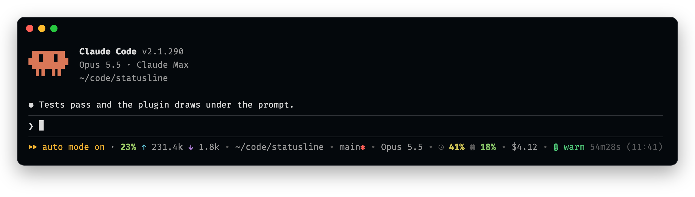
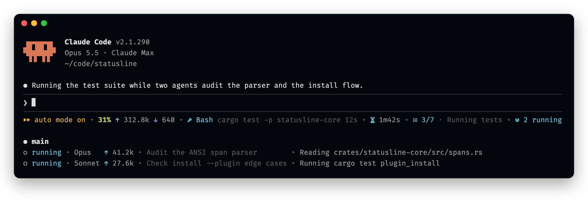
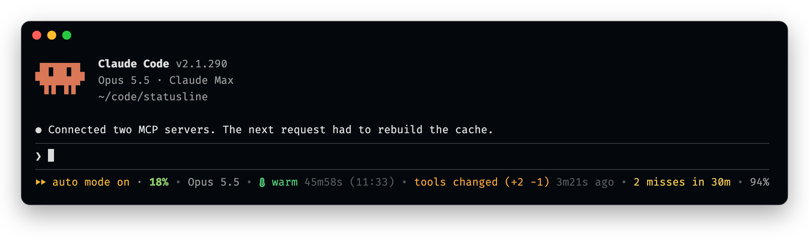
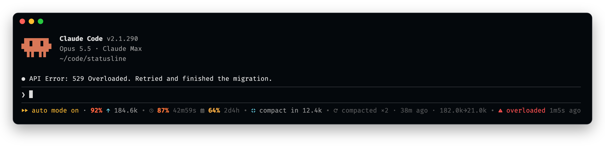
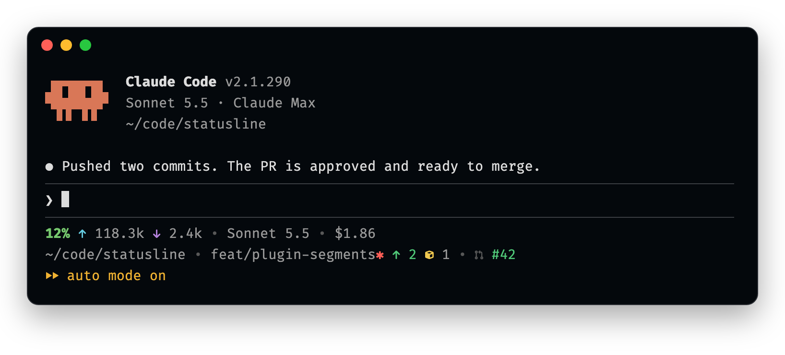
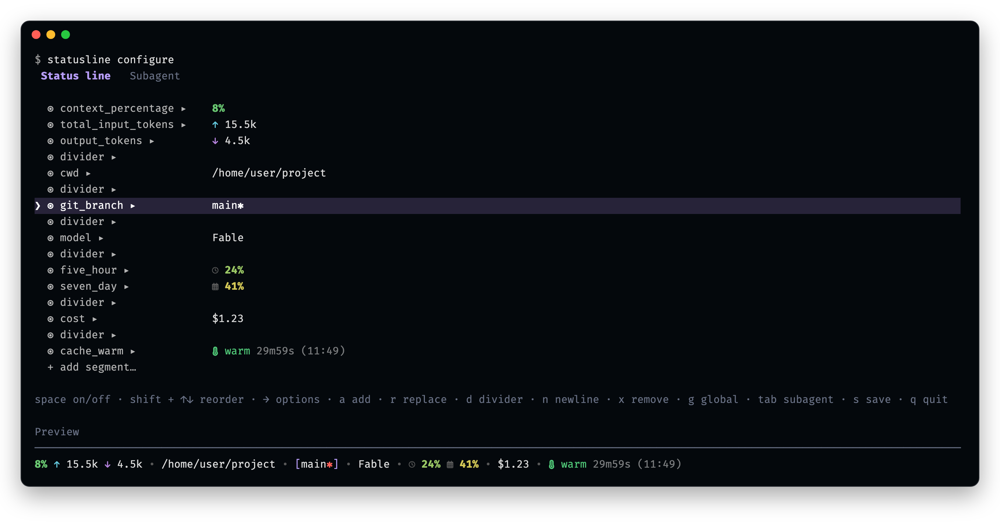
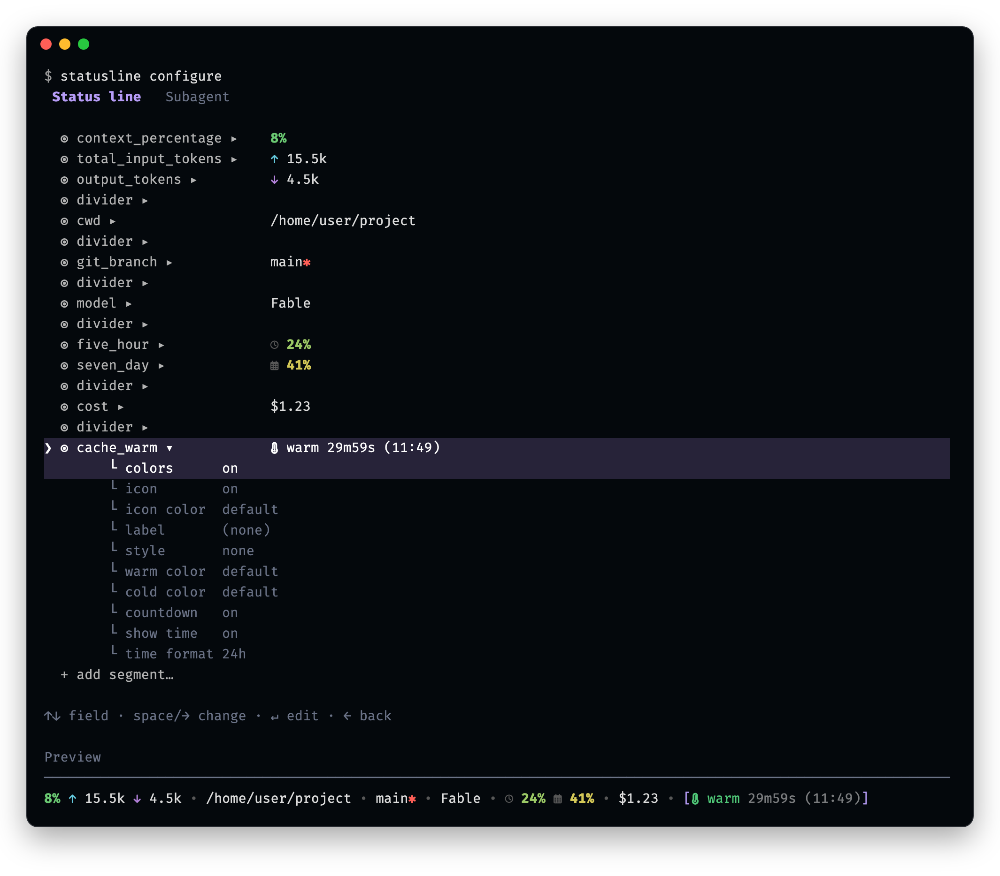

# statusline

A fast, native statusline for [Claude Code](https://docs.anthropic.com/en/docs/claude-code) that shows context window
usage, session/weekly usage limits and extra usage credits.

<p align="center">
  
</p>

## Install

```
brew install ryanclark/tap/statusline
```

macOS (Apple Silicon) and Linux (arm64/amd64) are supported. Without Homebrew, install a prebuilt binary from the latest
GitHub release:

```
curl -fsSL https://raw.githubusercontent.com/ryanclark/statusline/main/install.sh | sh
```

The binary is installed to `~/.local/bin` (override with `INSTALL_DIR=...`). Append `-s -- v1.1.0` after `sh` to pin a
version. Or build from source with `just install` (requires [just](https://github.com/casey/just)).

Then wire it into Claude Code as a plugin (recommended) or as a native `statusLine`.

### Claude Code plugin (recommended)

```
statusline install --plugin
```

The plugin draws the line under the prompt and refreshes it on its own clock, so countdowns tick between turns, and it
adds the [live activity](#live-activity) segments. Needs Claude Code 2.1.287 or later.

The plugin also fetches your usage with the session's own claude.ai login, once a minute shared across every open chat,
so `extra_usage`, `fable_usage` and `credits` need no Chrome cookie or Keychain access. Sessions on an API key or a
third-party provider fall back to the cookie path below.

This creates `~/.statusline/settings.json` if it is missing, adds the `ryanclark` marketplace and installs the plugin at
user scope, pointed at the binary you ran. Pass `--dry-run` to see what would change, and `--claude <PATH>` when
`claude` is not on your `PATH`. If you installed the plugin with statusline 2.0.0, upgrade and run it again so the
marketplace checks out the plugin's new path.

Claude Code keeps an empty row for a `statusLine` that prints nothing, so an existing `statusLine` in
`~/.claude/settings.json` is saved to `~/.statusline/native-statusline.json` and removed. One that runs `statusline` is
removed without asking, anything else only after you confirm. `~/.claude/settings.json` is backed up to
`~/.statusline/backups/` before it changes. Pass `--keep-native` to keep it as a fallback for sessions where the plugin
does not load. It stays silent while the plugin draws.

To install from inside a session instead:

```
/plugin install statusline --marketplace ryanclark/statusline
```

The options screen sets:

| Option | Default | Description |
|---|---|---|
| `binary` | `statusline` | Path to the statusline binary, in full if it is not on `PATH` |
| `placement` | `below` | `below` replaces the hint line under the prompt, `above` uses the band over it |
| `intervalMs` | `1000` | How often countdowns and git state are re-rendered between turns |
| `cacheTtl` | `1h` | Prompt cache TTL assumed until a model switch reports the real one (`1h` or `5m`) |

Change them later with `/plugin`, or from a shell:

```
echo '{"binary": "/opt/homebrew/bin/statusline"}' | claude plugin configure statusline@ryanclark --values-stdin
```

`statusline install --native` uninstalls the plugin and restores the saved `statusLine`. Add `--remove-marketplace` to
also remove the `ryanclark` marketplace.

### Native statusLine

```
statusline install
```

Use this when the plugin cannot load: Claude Code older than 2.1.287, a third-party provider, or nonessential traffic
disabled. It wires Claude Code's `settings.json` to call `statusline` and creates `~/.statusline/settings.json` when it
is missing. Pass `--subagent` to also wire the agent panel rows to `statusline subagent`. The line only refreshes when
Claude Code redraws it, and the live activity segments stay empty.

### Keychain access (API segments only)

This applies to the native `statusLine` only, as the plugin fetches usage with the session's login. If you include
`extra_usage`, `fable_usage`, or `credits`, statusline reads your Chrome session cookie to fetch usage data from
claude.ai. On first run, macOS will prompt you to allow access to "Chrome Safe Storage" in Keychain. Select **Always
Allow** so it doesn't prompt on every invocation. The organization is read from Claude Code's own `~/.claude.json`, so
it always matches the active account.

## Examples

Regenerate these with `just screenshots`.

#### Live activity (plugin only)

What Claude is running, how long the turn has taken, plan progress and running agents, with the subagent panel below.

`["context_percentage", "total_input_tokens", "output_tokens", "divider", "current_tool", "divider", "turn_elapsed", "divider", "todo_progress", "divider", "agents"]`



#### Prompt cache

How long the cache stays warm, why it last missed and how often it missed in the last 30 minutes. Miss causes and the
window are fullest with the plugin.

`["context_percentage", "divider", "model", "divider", "cache_warm", "divider", "cache_last_miss", "divider", "cache_misses", "divider", "session_cache_hit_ratio"]`



#### Under pressure

Context and rate limits near their ceilings, autocompact headroom, compaction history and the last API error. The last
three need the plugin.

`["context_percentage", "total_input_tokens", "divider", "five_hour", "seven_day", "divider", "autocompact_headroom", "divider", "compaction", "divider", "last_api_error"]`



#### Git, on two rows (native statusLine)

`["context_percentage", "total_input_tokens", "output_tokens", "divider", "model", "divider", "cost", "newline", "cwd", "divider", {"type": "git_branch", "dirty": true}, "git_ahead_behind", "git_stash", "divider", "pr"]`



## What it shows

By default:

- **Context window** — percentage used, input/output token counts
- **5-hour rate limit** — current utilization with reset countdown when above threshold
- **7-day rate limit** — same as above
- **Extra usage** — spend against monthly limit (fetched by the plugin, or with Chrome cookie auth)

## Customising segments

Add a `segments` array to `~/.statusline/settings.json` to control what's shown and in what order:

```json
{
  "five_hour_reset_threshold": 70,
  "seven_day_reset_threshold": 100,
  "segments": [
    "context_percentage",
    "input_tokens",
    "output_tokens",
    "divider",
    "cwd",
    {"type": "git_branch", "dirty": true},
    "model",
    "divider",
    "five_hour",
    "seven_day",
    "divider",
    "extra_usage"
  ]
}
```

If `segments` is not set, the default layout is used: `context_percentage`, `total_input_tokens`, `output_tokens`, `divider`, `five_hour`, `seven_day`, `divider`, `extra_usage`.

### Interactive editor

Instead of editing the JSON by hand, run:

```
statusline configure
```

This opens an interactive editor with a live preview to add, remove, reorder and toggle segments and edit their options, writing the result to `~/.statusline/settings.json` (existing keys are preserved). Key hints: ↑↓ move, ⇧↑/⇧↓ reorder, space toggle, → options, `a` add, `s` save, `q` quit.





Press `Tab` to switch between the status line and the subagent layout. The subagent tab shows one preview row per sample task, and offers `i` to wire up `subagentStatusLine` when Claude Code does not have it yet.

### Available segments

Some segments need a recent Claude Code, and stay empty on older versions: `spend_limit`,
`cache_warm`, `session_cache_hit_ratio`, and `cache_misses` need 2.1.251 or later, `cache_last_miss`
needs 2.1.260, `pr` needs 2.1.234 for GitLab merge requests, and `repo` needs 2.1.260 for GitLab
projects nested in subgroups. In the agent panel, the per-task `model` needs 2.1.205 and `effort`
needs 2.1.214.

#### Context window

| Segment | Description |
|---|---|
| `context_percentage` | Context window used % (colored) |
| `context_remaining` | Remaining context % (colored) |
| `context_window_size` | Total context size (e.g. `200k`) |
| `total_input_tokens` | Current context input tokens (input + cache creation + cache read) with ↑ icon |
| `input_tokens` | Cumulative input tokens across the session with ↑ icon |
| `output_tokens` | Total output tokens with ↓ icon |
| `cache_read_tokens` | Cache read tokens with ↻ icon |
| `cache_hit_ratio` | Cache read as % of total input |
| `cache_warm` | Prompt cache state with ♨ icon: `warm` with time until it goes cold, or `cold` |
| `session_cache_hit_ratio` | Cache reads as % of all input tokens this session |
| `cache_misses` | Prompt cache misses in the last 30 minutes (`2 misses in 30m`), hidden at zero. Without the plugin, the session total, shown even at zero |
| `cache_last_miss` | Cause of the last prompt cache miss (e.g. `tools changed (+2 −1)`, `expired after 5m idle`) and how long ago, hidden after 30 minutes |
| `exceeds200k` | Warning indicator when context exceeds 200k tokens |

#### Rate limits

| Segment | Description |
|---|---|
| `five_hour` | 5-hour rate limit % with optional reset countdown |
| `seven_day` | 7-day rate limit % with optional reset countdown |
| `spend_limit` | Spend limit % with reset countdown (only present behind a Claude apps gateway) |
| `fable_usage` | Fable weekly rate limit % with reset countdown (calls the API) |
| `extra_usage` | Extra usage $used/$limit (calls the API) |

#### Cost & performance

| Segment | Description |
|---|---|
| `cost` | Total session cost in USD |
| `cost_rate` | Cost per minute ($/m) |
| `duration` | Total session duration |
| `api_duration` | Total API call time |
| `tokens_per_second` | Output tokens per second of API time |
| `lines_added` | Lines added with + icon |
| `lines_removed` | Lines removed with - icon |

#### Git

| Segment | Description |
|---|---|
| `git_branch` | Current git branch name |
| `git_ahead_behind` | Commits ahead/behind upstream (e.g. `↑3 ↓1`) |
| `git_stash` | Stash count with ⚑ icon |
| `pr` | Open pull request number (`!` for GitLab merge requests) with ⎇ icon, colored by review state, clickable link to the PR (link needs `colors`) |
| `repo` | Repository `owner/name` from the origin remote, clickable link to its web page (link needs `colors`) |

#### Environment

| Segment | Description |
|---|---|
| `cwd` | Current working directory (shortened with `~`) |
| `project_dir` | Project directory |
| `model` | Model display name |
| `model_id` | Full model ID |
| `version` | Claude Code version |
| `session_id` | Session ID |
| `session_name` | Session name (`--name` or `/rename`, else the generated title) |
| `vim_mode` | Vim mode (NORMAL, INSERT, etc.) |
| `agent_name` | Active agent name |
| `effort` | Reasoning effort level (`low` to `max`), colored by level |
| `thinking` | `thinking` when extended thinking is enabled |
| `fast_mode` | `fast` when fast mode is on |
| `worktree` | Worktree name (a worktree session, or any linked git worktree) |
| `account` | Current Claude account nickname (from `~/.statusline/accounts.json`, colored per entry) |

#### Live activity

These need the [plugin](#claude-code-plugin). With the plain `statusLine` command they render nothing.

| Segment | Description |
|---|---|
| `current_tool` | Tool call in flight with ⚙ icon, its command or path, and how long it has run (e.g. `⚙ Bash cargo test 12s`), `+2` when more run in parallel |
| `turn_elapsed` | Time the running turn has taken with ⏱ icon (`⏱ 1m42s`), or the last turn's length dimmed between turns (`last 2m10s`) |
| `permission_pending` | Tool waiting on approval with ⏸ icon and how long, kept up while it runs (`⏸ Bash waiting or running 45s`) |
| `last_api_error` | Why the last turn failed with ⚠ icon and how long ago (`⚠ overloaded 2m ago`, `rate limited`, `hit max tokens`, `interrupted`) |
| `todo_progress` | Todo items done out of total with ☑ icon and the active item (`☑ 3/7 · Running tests`) |
| `agents` | Background agents with ⁂ icon (`⁂ 3 running · 1 idle`) |
| `compaction` | With ⟳ icon, `⟳ compacting 18s` while one runs, else how many, when, and the tokens before and after (`compacted ×2 · 14m ago · 182.0k→21.0k`) |
| `autocompact_headroom` | Tokens left before autocompact triggers with ↧ icon (`compact in 38.0k`), or `autocompact off` |

#### Layout

| Segment | Description |
|---|---|
| `divider` | Separator character (default `•`) |
| `newline` | Line break: segments after it render on the next row |

Claude Code shows each line of output as its own status row, so `newline` splits the status line into
multiple rows. Dividers next to a line break are dropped, and a break whose row would be empty is skipped.

### Advanced segment options

Each segment can be a plain string or an object with options:

```json
[
  "context_percentage",
  {"type": "input_tokens", "icon": false},
  {"type": "model", "style": "dim"},
  {"type": "git_branch", "dirty": true, "dirty_color": "yellow"},
  {"type": "cost", "style": "bold"},
  {"type": "divider", "label": "|"}
]
```

| Option | Type | Default | Description |
|---|---|---|---|
| `colors` | bool | `true` | Enable/disable ANSI colors |
| `icon` | bool | `true` (`false` for `task_status`) | Show/hide the segment's icon |
| `icon_color` | string | — | Custom icon color |
| `label` | string | — | Custom label replacing the default icon |
| `style` | string | — | Text style: `bold`, `dim`, `italic`, `underline` |

Colors can be specified as named colors (`red`, `cyan`, `yellow`, `green`, `blue`, `purple`, `orange`, `white`, `gray`), hex (`#FF5050`, `#F00`), or RGB (`rgb(255, 80, 80)`).

#### git_branch options

| Option | Type | Default | Description |
|---|---|---|---|
| `dirty` | bool or string | `false` | Show dirty indicator. `true` for default `*`, or a custom string |
| `dirty_color` | string | `red` | Color of the dirty indicator |

#### cache_warm options

| Option | Type | Default | Description |
|---|---|---|---|
| `warm_color` | string | `green` | Color of the ♨ icon and the `warm` state |
| `cold_color` | string | `yellow` | Color of the ♨ icon and the `cold` state |

#### Countdown options

`five_hour`, `seven_day`, `spend_limit`, `fable_usage`, and `cache_warm` count down to a reset or
expiry. Each can also print the clock time it counts down to, in your local time zone, as
`2h 10m (16:00)`:

| Option | Type | Default | Description |
|---|---|---|---|
| `show_countdown` | bool | `true` | Show the time left |
| `show_time` | bool | `false` (`true` for `cache_warm`) | Show the clock time after the countdown, or alone when the countdown is off |
| `time_format` | string | `24h` | `24h` for `16:00`, `12h` for `4:00pm` |

#### Cache miss options

| Option | Type | Default | Description |
|---|---|---|---|
| `within` | string or `null` | `"30m"` | How far back to look, e.g. `"90s"`, `"2h"` or `"1h30m"`, or `"session"`/`null` for no limit. A value that does not parse counts as `"30m"`. Without the plugin `cache_misses` shows the session total |
| `details` | bool | `true` | `cache_last_miss` only: add the tool count and system prompt size changes, as in `tools changed (+2 −1)` |

```json
[{"type": "cache_misses", "within": "2h"}, {"type": "cache_last_miss", "within": "session", "details": false}]
```

#### account options

| Option | Type | Default | Description |
|---|---|---|---|
| `capitalize` | bool | `true` | Capitalise the first letter of the nickname |

### Nerd Font icons

If you use a [Nerd Font](https://www.nerdfonts.com/), enable richer icons by setting `nerd_font` in `~/.statusline/settings.json`:

```json
{
  "nerd_font": true
}
```

When enabled, segments use Nerd Font glyphs instead of the default Unicode symbols. To install one:

```
brew install font-fira-code-nerd-font
```

### Custom divider

Set the `divider` field in settings to change the default divider character:

```json
{
  "divider": "|"
}
```

### Per-account overrides

If you keep multiple Claude Code accounts, you can point each one at its own browser profile and even its own layout. Create `~/.statusline/accounts.json`:

```json
{
  "accounts": [
    {
      "nickname": "work",
      "email": "ryan@work.com",
      "organization_uuid": "work-org-uuid",
      "color": "cyan",
      "browser": "chrome",
      "profile": "Profile 2",
      "segments": ["context_percentage", "divider", "extra_usage"]
    },
    {
      "nickname": "personal",
      "email": "ryan@home.com",
      "organization_uuid": "personal-org-uuid"
    }
  ]
}
```

When the active Claude Code account matches an entry, statusline uses that entry's `browser` and `profile` to read cookies. When `segments` is present on the entry, it replaces the global layout for that account. Missing fields fall back to global settings.

To list the browser profiles available on your machine:

```
statusline profiles
statusline profiles --browser chrome
```

### Disabling the update check

Set `skip_update_check` in `~/.statusline/settings.json` to suppress the once-a-day update check and the update banner:

```json
{
  "skip_update_check": true
}
```

### Letting Claude see its own session

Set `capture_snapshots` in `~/.statusline/settings.json` (or toggle it under `g` in `statusline configure`) to save the JSON Claude Code pipes in on every render to `~/.statusline/sessions/<session_id>.json`. Snapshots untouched for 7 days are deleted when a new session starts. With the plugin, snapshots come from the native `statusLine` when it runs, since its input is complete.

```json
{
  "capture_snapshots": true
}
```

When Claude runs `statusline` itself from inside Claude Code (`CLAUDECODE` and `CLAUDE_CODE_SESSION_ID` set, nothing on stdin), it prints a JSON report for that session instead of a status line: model, context window, cost, the 5-hour and 7-day rate limits with reset countdowns, plus the account's claude.ai limits (including Fable), extra usage and credits from the usage cache.

### Data sources

Most segments read from the JSON that Claude Code pipes via stdin — no external calls needed. The exceptions:

- `extra_usage`, `fable_usage`, `credits` — the plugin fetches them with the session's login. The native `statusLine` calls the claude.ai API with your Chrome session cookie
- `git_branch`, `git_ahead_behind`, `git_stash` — run git commands in the project directory

If you don't include `extra_usage`, `fable_usage`, or `credits` in your segments, the native `statusLine` skips the API call and Chrome cookie auth entirely. The plugin fetches usage either way.

## Subagent status line

Claude Code can also hand the agent panel's rows to a command through `subagentStatusLine` in
`~/.claude/settings.json`. `statusline install --subagent` wires it up; by hand, the entry is:

```json
"subagentStatusLine": {"type": "command", "command": "statusline subagent"}
```

`statusline subagent` reads the task list on stdin and prints one row per task, built from the
`subagent_segments` list in `~/.statusline/settings.json`. The default layout is `task_name`, `task_status`, `divider`, `model`, `task_tokens`, `divider`,
`task_description`, `divider`, `task_label`. Ad-hoc agents carry no `name`, so that column simply drops out for them. Every task carries its own model, effort, cwd, and token counts, so `model`,
`model_id`, `effort`, `cwd`, `context_percentage`, `context_window_size`, and `total_input_tokens`
work per task next to the task segments below. A task whose row renders empty keeps Claude Code's
default row.

Rows are laid out as a grid: each segment is a column as wide as its widest value across the tasks,
and a divider sits after the padded cell before it, so the columns and dividers line up down the
panel. Set `"subagent_grid": false` in `~/.statusline/settings.json`, or toggle `subagent_grid`
under `g` global in `statusline configure`, for one free-form line per task instead.

#### Subagent

| Segment | Description |
|---|---|
| `task_name` | Subagent name with ⚙ icon |
| `task_status` | Task status (`running`, `completed`, `failed`, `pending`), colored by state; `"icon": true` adds a ● in the same color (off by default, since the panel draws its own marker) |
| `task_description` | Task description, dimmed |
| `task_elapsed` | Time since the task started with ⏱ icon |
| `task_tokens` | Tokens the task has used with ↑ icon |
| `task_label` | What the task is doing right now, from Claude Code's live label. Hidden when it only repeats the description |


## Options

Override the thresholds for showing reset countdowns:

```
statusline -f 50 -s 80
```

Or set them permanently during install:

```
statusline install -f 50 -s 80
```

The defaults are `-f 70` (show 5-hour reset countdown above 70%) and `-s 100` (never show 7-day reset countdown). Setting a threshold to `100` effectively disables the countdown for that period.

## Building from source

### Basic build

```
just install
```

This builds without codesigning. The Chrome Keychain password is cached locally to `~/.statusline/chrome_key` to avoid repeated Keychain prompts during development.

### Codesigned build

Codesigning makes Keychain's "Always Allow" persist across rebuilds. You need an [Apple Developer Program](https://developer.apple.com/programs/) membership.

#### Creating a certificate

If you don't have a Developer ID Application certificate yet:

```
just cert-request "Your Name"
```

This generates a certificate signing request. Upload `devid.csr` at the URL shown, select **Developer ID Application**, and download the `.cer` file. Then import it:

```
just cert-import ~/Downloads/developerID_application.cer
```

This installs the certificate into your Keychain and prints your signing identity. Clean up afterwards:

```
just cert-clean
```

#### Building

```
just install-signed "Your Name" "ABC123XYZ"
```

To skip the arguments, save the identity in a `justfile.local` next to the `justfile` (it is gitignored):

```
export DEVELOPER_NAME := "Your Name"
export TEAM_ID := "ABC123XYZ"
```

To find your name and team ID:

```
security find-identity -v -p codesigning | grep "Developer ID Application"
```

## Requirements

- macOS (Apple Silicon)
- Google Chrome (only if using `extra_usage`, `fable_usage`, or `credits`)
- Rust toolchain (for building from source)
